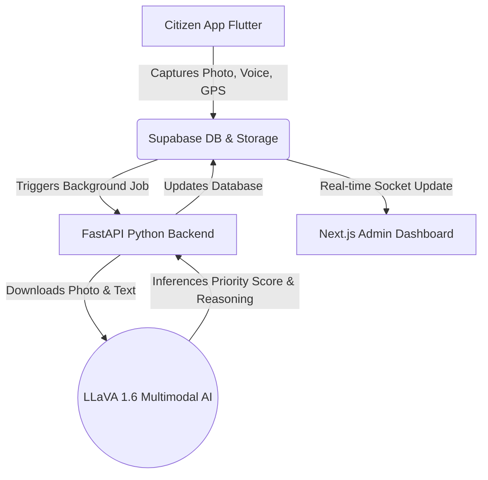

<!-- Badges -->


# SmartCity Infrastructure Damage Assessment System

SmartCity is a comprehensive, end-to-end platform designed to streamline the reporting, AI-driven analysis, and management of urban infrastructure issues like potholes, damaged roads, and broken streetlights. It bridges the gap between citizens reporting local issues and city administrators managing them, drastically reducing response times through automated AI severity assessments and rich spatial data visualizations.

Traditionally, infrastructure damage reports rely on manual sorting and subjective prioritization. SmartCity solves this problem by using a local state-of-the-art multimodal AI model (LLaVA-1.6 Mistral 7B) to instantly analyze citizen photos and descriptions, outputting a quantifiable priority score without human intervention. 

---

## 📑 Table of Contents
1. [Screenshots & Demo](#-screenshots--demo)
2. [Key Features](#-key-features)
3. [Architecture & Data Flow](#-architecture--data-flow)
4. [Tech Stack in Detail](#-tech-stack-in-detail)
5. [Prerequisites](#-prerequisites)
6. [Installation & Setup](#-installation--setup)
    - [Supabase Setup](#1-database-setup-supabase)
    - [Python AI Backend](#2-ai-backend-python--fastapi)
    - [Next.js Admin Dashboard](#3-admin-dashboard-frontend)
    - [Flutter Mobile Application](#4-citizen-report-app-application)
7. [Environment Variables Reference](#-environment-variables-reference)
8. [Usage & Local Development](#-usage--local-development)
9. [Project Structure](#-project-structure)
10. [AI Model Configuration](#-ai-model-configuration)
11. [API Reference](#-api-reference)
12. [Testing Guide](#-testing-guide)
13. [Deployment Instructions](#-deployment-instructions)
14. [Roadmap](#-roadmap)
15. [Contributing](#-contributing)
16. [FAQ & Troubleshooting](#-faq--troubleshooting)
17. [License](#-license)
18. [Acknowledgments](#-acknowledgments)

---


## ✨ Key Features
- **Effortless Issue Reporting:** Citizens can submit infrastructure problems using a Flutter mobile app featuring camera capture, GPS tagging, and voice-to-text descriptions (available in multiple languages including English and Hindi).
- **Automated AI Triage:** Submissions are automatically assessed by a locally hosted Large Multimodal Model (LMM). The system extracts context from photos and assigns an objective Priority Score.
- **Admin Command Center:** A secure Next.js dashboard provides real-time updates, geospatial map clustering of issues, and repair workflow tracking.
- **Offline & Low-Bandwidth Resilience:** App functions are optimized with local state caching (via `shared_preferences`) and local drafts.
- **Role-Based Access Control:** Built-in Supabase authentication ensures citizen data is secure and admins only see what they have permission to see.

---

## 🏗️ Architecture & Data Flow



1. **Citizen Reporting Phase:** Users open the cross-platform Flutter app, take a photo (`image_picker`), speak their problem (`speech_to_text`), and get their location (`geolocator`). 
2. **Data Ingestion:** The data payload is uploaded safely to Supabase (PostgreSQL for metadata, Supabase Storage for images).
3. **Assessment Phase:** A background watcher in FastAPI spots the new "Unassessed" row. It triggers the `InfrastructureDamageAssessor` class which processes the image locally using PyTorch and quantization.
4. **Resolution Phase:** Once the score (1-100) and rationale are populated, the Next.js frontend updates its UI instantly. Admins use Chart.js insights to dispatch repair crews effectively.

---

## 🛠️ Tech Stack in Detail

### 1. Mobile Application (`/application`)
- **Core Framework:** Flutter (Dart ^3.8.1).
- **State Management:** Provider pattern mapping global settings (language, auth).
- **Location Services:** `flutter_map` with `latlong2` for UI; `geolocator` and `geocoding` for reverse lookups.
- **Device Integrations:** `image_picker`, `speech_to_text`, `flutter_tts` (for accessibility), `permission_handler`, and `flutter_local_notifications`.
- **Localization:** Flutter multi-language support (English/Hindi) via `.arb` files.

### 2. AI Backend & API (`/backend`)
- **Core Framework:** Python 3.10+, FastAPI (using modern `lifespan` contexts and fully non-blocking ThreadPool offloading for heavy ML inference and database tasks).
- **Machine Learning / AI:** `transformers`, `torch` (PyTorch). Uses 4-bit Nf4 quantization (`bitsandbytes`) to fit the massive 7B parameter vision model into standard consumer VRAM.
- **Model Used:** `llava-v1.6-mistral-7b-hf` (Vision-Language Model).
- **Database Connection:** `supabase` Python client (Synchronous client safely mapped to async threadpools to prevent event-loop freezing).

### 3. Web Dashboard (`/frontend`)
- **Core Framework:** Next.js 15.3.4 (App Router) and React 19.
- **Styling:** Tailwind CSS v4, utilizing heavily optimized utility classes.
- **Icons & UI:** Heroicons and Lucide React.
- **Charts:** `chart.js`, `react-chartjs-2`, and `recharts` for KPI tracking.
- **Auth & Linking:** `@supabase/auth-helpers-nextjs` directly synced via `createClientComponentClient()` for secure, React-context-aware RLS access on the browser.

---

## ⚙️ Prerequisites

Before you clone and build the application, make sure you have the following systems configured:
- **Node.js**: v18 or newer (required for the Next.js frontend).
- **Python**: v3.10.x (required for the AI backend dependencies).
- **Flutter SDK**: v3.8.1 or newer (ensure `flutter doctor` passes without major issues).
- **Database**: A newly provisioned project on [Supabase](https://supabase.com).
- **Hardware Requirement (Crucial):** For smooth AI inference, an NVIDIA GPU with at least 8GB of VRAM is highly recommended. The system uses 4-bit quantization, but the LMM is heavily resource-intensive.
- **Local Model Download:** Obtain the weights for `llava-v1.6-mistral-7b-hf` via Hugging Face. Place the model files in `C:\Users\samas\llava-v1.6-mistral-7b-hf` (or update the path in `/backend/img.py`).

---

## 🚀 Installation & Setup

Clone the repository to your local machine:
```bash
git clone https://github.com/your-username/smartcity.git
cd smartcity
```

### 1. Database Setup (Supabase)
1. Log into your Supabase Dashboard and provision a new project.
2. Under "SQL Editor", run the following schema to establish the base structure:
   ```sql
   CREATE TABLE issues (
       id UUID PRIMARY KEY DEFAULT uuid_generate_v4(),
       title TEXT NOT NULL,
       description TEXT,
       image_urls TEXT[] DEFAULT '{}',
       status TEXT DEFAULT 'Unassessed',
       priority_score INTEGER,
       assessment_reasoning TEXT,
       assessed_at TIMESTAMP WITH TIME ZONE,
       created_at TIMESTAMP WITH TIME ZONE DEFAULT NOW()
   );
   ```
3. Set up a public Storage bucket named `issues-images`.
4. Grab your `Project URL`, `Anon Key`, and `Service Role Key` for the config files.

### 2. AI Backend (Python & FastAPI)
Ensure your environment supports CUDA if you are leveraging GPU acceleration.

```bash
cd backend
python -m venv venv

# Windows Activation
.\venv\Scripts\activate
# Mac/Linux Activation
source venv/bin/activate

# Install the required libraries for ML and APIs
pip install fastapi uvicorn supabase python-dotenv transformers torch torchvision pillow requests httpx accelerate bitsandbytes
```

Configure the environment variables (see reference below).

### 3. Admin Dashboard (Frontend)
Next.js leverages Turbopack in this project for blazingly fast development compilation.

```bash
cd frontend
npm install
```

Configure the `.env.local` to point to Supabase, then let the package manager index your dependencies.

### 4. Citizen Report App (Application)
Ensure Xcode and Android Studio are properly mapped to your Flutter environment.

```bash
cd application
flutter pub get
```

Ensure the localized translation packages correctly build:
```bash
flutter gen-l10n
```

---

## 🔧 Environment Variables Reference

You will need distinct configuration files to run the full stack locally. DO NOT commit these files to version control.

**Backend (`/backend/.env`)**
```env
SUPABASE_URL="https://[YOUR_PROJECT_ID].supabase.co"
SUPABASE_SERVICE_KEY="[YOUR_SERVICE_ROLE_KEY]"
# Optional: Change the model directory if you installed it elsewhere
MODEL_PATH="C:\Users\samas\llava-v1.6-mistral-7b-hf"
```

**Frontend (`/frontend/.env.local`)**
```env
NEXT_PUBLIC_SUPABASE_URL="https://[YOUR_PROJECT_ID].supabase.co"
NEXT_PUBLIC_SUPABASE_ANON_KEY="[YOUR_ANON_KEY]"
```

**Flutter App (`/application/.env`)**
```env
SUPABASE_URL="https://[YOUR_PROJECT_ID].supabase.co"
SUPABASE_ANON_KEY="[YOUR_ANON_KEY]"
```

---

## 💻 Usage & Local Development

To run the complete system locally, open three distinct terminal windows.

### Terminal 1: Spin up the AI Pipeline
```bash
cd backend
# With virtual environment activated
uvicorn main:app --reload --host 0.0.0.0 --port 8000
```
*Note: The first launch will take extra time as it allocates PyTorch tensors and loads the 7B parameter model.*

### Terminal 2: Initialize Web Administrator
```bash
cd frontend
npm run dev
```
*Access the interface via `http://localhost:3000`.*

### Terminal 3: Build and Run Mobile Client
```bash
cd application
flutter run -d chrome  # for quick web prototyping
# OR
flutter run            # for physical devices/emulators
```

---

## 📁 Project Structure

```text
smartcity/
├── application/                  # Flutter Mobile source code
│   ├── android/                  # Android specific build files
│   ├── ios/                      # iOS specific build files
│   └── lib/                      
│       ├── l10n/                 # Localization (Eng/Hindi)
│       ├── providers/            # State management 
│       ├── screens/              # UI Views (Home, Auth, Map)
│       ├── services/             # Background notification services
│       └── utils/                # Supabase helpers & formatting
├── backend/                      # Python AI & FastAPI core
│   ├── img.py                    # Multi-modal LMM initialization & logic
│   └── main.py                   # API Routes and async workers
└── frontend/                     # Next.js Dashboard source code
    ├── src/
    │   ├── app/                  # Route handlers (App router)
    │   └── lib/                  # Auth clients & components
    ├── tailwind.config.ts        # Design system styles
    └── package.json              
```

---

## 🔬 AI Model Configuration

The application utilizes the `InfrastructureDamageAssessor` class within the backend to interpret visual damage.
- **Architecture**: LLaVA (Large Language-and-Vision Assistant) represents a projection of a vision encoder into an LLM (Mistral).
- **Prompt Guarding:** The `img.py` file includes custom regular expressions (regex) that clean the raw generative text, stripping out `<|im_start|>` instructions and system scaffolding before storing it into Supabase.
- **Quantization:** We utilize `BitsAndBytesConfig` at 4-bit precision to maintain logic while dropping VRAM usage down by over 60%.

---

## 📚 API Reference

When the FastAPI server is running locally, it mounts an OpenAPI specification.
Navigate to the following URLs for interactive schema definitions:
- **Swagger UI:** `http://localhost:8000/docs`
- **ReDoc Definition:** `http://localhost:8000/redoc`

**Key Endpoints:**
- `POST /process` - Manually queue an issue UUID to force AI inference. (Usually managed by the database background webhook).

---

## 🧪 Testing Guide

Running tests across each segment of the stack ensures system reliability.

**Application (Flutter):**
```bash
cd application
flutter test
```

**Frontend (Next.js):**
```bash
cd frontend
npm run lint
```
*(Add Jest configurations depending on UI expansion needs).*

---

## 🌐 Deployment Instructions

- **Backend:** Best deployed to an NVIDIA instance on AWS (EC2/EKS) or vast.ai/Runpod due to GPU needs. Dockerize the FastAPI app using the provided `python:3.10-slim` base image.
- **Frontend:** Seamless deployment via [Vercel](https://vercel.com). Just connect the repository, map the `frontend/` root folder, and add the environment variables online.
- **Application:** Use standard Flutter build pipelines for distribution:
  ```bash
  flutter build apk --release
  flutter build ipa
  ```

---

## 🗺️ Roadmap
We have aggressive ambitions for the SmartCity ecosystem:
- [x] Initial Citizen App for issue reporting (Photos & GPS).
- [x] Local multimodal AI integration for severity assessment.
- [x] Web dashboard for city administrators.
- [ ] **Phase 2:** Complete push notifications for real-time status updates to citizens.
- [ ] **Phase 2:** Multi-language voice-to-text pipeline refinements and regional NLP support.
- [ ] **Phase 3:** Predictive maintenance modeling (flagging recurring potholes).
- [ ] **Phase 3:** Automated worker dispatch ticketing integrations.

---

## 🤝 Contributing

Contributions are what make the open-source community such an amazing place to learn, inspire, and create. Fast bug reports and pull requests are **greatly appreciated**.

1. Fork the Project.
2. Create your Feature Branch: `git checkout -b feature/AmazingFeature`
3. Commit your Changes: `git commit -m 'Add some AmazingFeature'`
4. Push to the Branch: `git push origin feature/AmazingFeature`
5. Open a Pull Request ensuring you detail what components (Flutter/Next/FastAPI) are being altered.

---

## ❓ FAQ & Troubleshooting

**Q: The backend FastAPI service crashes stating Out of Memory (OOM) errors during inference.**
A: Ensure you have `load_in_4bit=True` properly configuring BitsAndBytes on the model. If you have under 6GB of VRAM, you might need to use CPU offloading (which is significantly slower).

**Q: The backend AI model is failing to load its config file.**
A: Ensure you have adjusted the `model_path` in `/backend/img.py` to point to your correct, fully-downloaded local folder for the Hugging Face LLaVA weights. 

**Q: I get CORS or Authentication errors on the frontend dashboard.**
A: Verify your Next.js `.env.local` Supabase URLs match exactly with your actual Supabase instance, without trailing slashes. Furthermore, ensure your Row Level Security (RLS) policies in Supabase allow the service roles robust read/write access.

**Q: Voice-to-text in Flutter isn't returning any strings.**
A: Make sure you accept microphone and speech permissions. Run `flutter clean` and rebuild if iOS pod permissions aren't cleanly generating the `Info.plist` allowances.

---

## 📄 License

Distributed under the MIT License. See `LICENSE` for more information.

---

## 🙏 Acknowledgments
- [Flutter](https://flutter.dev/) for cross-platform app development.
- [Next.js](https://nextjs.org/) for the web dashboard framework.
- [FastAPI](https://fastapi.tiangolo.com/) for a robust, async Python boundary.
- [Supabase](https://supabase.com/) for the real-time open-source Firebase alternative.
- [Hugging Face](https://huggingface.co/) and the creators of LLaVA for driving state-of-the-art multimodal vision frameworks to open source.
- [Tailwind CSS](https://tailwindcss.com/) for effortless UI styling.
- [Leaflet / Flutter Map](https://github.com/fleaflet/flutter_map) for geospatial plotting.

## 📄 License

Distributed under the MIT License. See `LICENSE` for more information.

---

## 🙏 Credits / Acknowledgments
- [Flutter](https://flutter.dev/) for cross-platform app development.
- [Next.js](https://nextjs.org/) for the web dashboard framework.
- [FastAPI](https://fastapi.tiangolo.com/) for the robust Python backend.
- [Supabase](https://supabase.com/) for the open-source Firebase alternative.
- [Hugging Face](https://huggingface.co/) and the creators of LLaVA for the accessible multimodal models.

